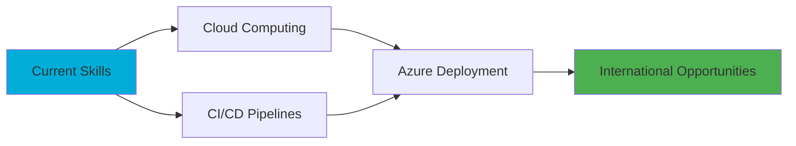

<div align="center">

<!-- Profile Header with Typing Animation -->


</div>

<div align="center">
  
[](https://www.linkedin.com/in/omar-gamal-761590256)
[](mailto:Omargamal1132004@gmail.com)
[](https://github.com/omargamal1121)

</div>

---

<div align="center">

### 🎯 Backend Developer | Software Engineer | .NET Specialist

```ascii
🎓 Computer Science @ Banha University
💼 Specializing in Clean Architecture & Scalable Systems
🌍 Building Production-Ready APIs
```

</div>

---

## 🚀 About Me

```csharp
public class Developer
{
    public string Name { get; set; } = "Omar Gamal";
    public string Role { get; set; } = "Backend Developer";
    public string Education { get; set; } = "Computer Science - Banha University";
    public List<string> Specializations { get; set; } = new()
    {
        ".NET 9 & ASP.NET Core",
        "Entity Framework Core",
        "MySQL & Redis",
        "Clean Architecture",
        "RESTful API Design"
    };
    public string CurrentFocus { get; set; } = "Building enterprise-grade backend systems";
    public string Goal { get; set; } = "Securing international opportunities through quality code";
}
```

<details>
<summary>🔍 More About Me</summary>

- 🏗️ **Architecture Enthusiast**: Implementing Clean Architecture, Repository & Unit of Work patterns
- ⚡ **Performance Focused**: Leveraging Redis caching and Hangfire for background jobs
- 🔐 **Security Conscious**: Implementing robust authentication and authorization
- 📚 **Continuous Learner**: Currently exploring Cloud (Azure) and CI/CD pipelines
- 🎯 **Quality Driven**: Passionate about maintainable code, error handling, and best practices
- 🤝 **Full-Stack Aware**: Experience integrating APIs with React frontends

</details>

---

## 🛠️ Technology Stack

<div align="center">

### Backend Development


### Database & Caching


### Frontend & Tools


### Additional Skills


</div>

---

## 📁 Featured Projects

<table>
<tr>
<td width="50%">

### 🛍️ Fashion E-Commerce API
[](https://github.com/omargamal1121/Fashion)

**Enterprise-grade REST API with:**
- ✅ Full CRUD Operations
- 🔐 Role-Based Access Control
- 👨‍💼 Admin Management Panel
- ⚡ Redis Caching Layer
- 🔄 Hangfire Background Jobs
- 📁 Image Upload System
- 📝 Advanced Error Logging
- 🗑️ Soft Delete Implementation

**Tech:** `.NET 9` `EF Core` `MySQL` `Redis` `Hangfire`

</td>
<td width="50%">

### ✅ To-Do List Application
[](https://github.com/omargamal1121/To-Do-List)

**MVC Task Management System with:**
- 📋 Complete Task CRUD
- 👥 Role-Based Authentication
- 🎯 Separate Admin/User Interfaces
- 🎨 Clean MVC Architecture
- 📊 Task Status Management

**Tech:** `ASP.NET MVC` `Entity Framework` `MySQL`

</td>
</tr>
</table>

---

## 📊 GitHub Statistics

<div align="center">


</div>

<div align="center">

[](https://git.io/streak-stats)

</div>

---

## 🎯 Current Goals & Learning Path



- ☁️ **Next Up:** Microsoft Azure & Cloud Architecture
- 🔄 **Learning:** CI/CD with GitHub Actions & Azure DevOps
- 🎯 **Goal:** Contribute to open-source .NET projects
- 💼 **Objective:** Secure remote backend developer position

---

## 💭 Philosophy

<div align="center">

### *"I write code with structure, test with intention, and build systems with growth in mind."*

```
┌─────────────────────────────────────────────────┐
│  Code Quality > Quick Solutions                 │
│  Scalability > Immediate Features               │
│  Best Practices > Shortcuts                     │
└─────────────────────────────────────────────────┘
```

> 🚀 Every project is a product, not just practice—clean code, real features, solid architecture.

</div>

---

## 📫 Let's Connect!

<div align="center">

I'm always interested in collaborating on backend projects or discussing .NET architecture!

[](mailto:Omargamal1132004@gmail.com)
[](https://www.linkedin.com/in/omar-gamal-761590256)
[](https://github.com/omargamal1121)

### 💬 Open to opportunities in backend development, API design, and system architecture!

</div>

---

<div align="center">


**Thanks for visiting! ⭐ Feel free to star my repositories if you find them interesting!**

</div>
