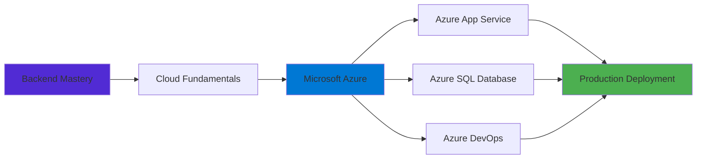

<div align="center">

<!-- Dynamic Typing Header -->


</div>

<div align="center">
  
[](https://www.linkedin.com/in/omar-gamal-761590256)
[](mailto:Omargamal1132004@gmail.com)
[](https://github.com/omargamal1121)

</div>

---

<div align="center">

### 🎯 .NET Backend Engineer | E-Commerce Specialist | Instructor

```ascii
💼 Freelance Backend Developer
🎓 Computer Science @ Banha University
🧑‍🏫 Backend Instructor @ 3C School
☁️ Exploring Microsoft Azure & Cloud Architecture
```

</div>

---

## 👨‍💻 About Me

```csharp
public class OmarGamal : BackendDeveloper
{
    public string CurrentRole { get; set; } = "Freelance .NET Backend Developer";
    public string SecondRole { get; set; } = "Backend Instructor @ 3C School";
    
    public List<string> CoreExpertise { get; set; } = new()
    {
        ".NET 9 & ASP.NET Core",
        "Entity Framework Core",
        "Clean Architecture & Design Patterns",
        "RESTful API Development",
        "E-Commerce System Design"
    };
    
    public Dictionary<string, string[]> TechStack { get; set; } = new()
    {
        ["Backend"] = new[] { ".NET 9", "C#", "ASP.NET Core", "EF Core" },
        ["Database"] = new[] { "MySQL", "Pomelo", "Redis" },
        ["DevOps"] = new[] { "Hangfire", "Serilog", "FluentValidation" },
        ["Learning"] = new[] { "Microsoft Azure", "CI/CD Pipelines" }
    };
    
    public string CurrentProject { get; set; } = "Ava-Fit - Scalable E-Commerce API";
    public string Mission { get; set; } = "Build production-grade systems for global impact";
}
```

### 🚀 What I Do

I design and build **scalable, maintainable backend systems** with a focus on **E-Commerce solutions**. As a freelancer, I've delivered production-ready APIs that handle real-world business needs. As an instructor, I teach aspiring developers the fundamentals of backend engineering.

I believe in:
- 🏗️ **Clean Architecture** — Building systems that scale and evolve gracefully
- 🔐 **Security-First Design** — Proper authentication, authorization, and data protection
- ⚡ **Performance Optimization** — Smart caching strategies and background job processing
- 📝 **Code Quality** — Maintainable, tested, and well-documented code
- 🌍 **International Standards** — Writing code that meets global industry expectations

---

## 🏆 Achievements & Experience

<table>
<tr>
<td width="33%" align="center">

### 💼 Freelance Developer
Built production-grade **E-Commerce backends** for international clients
- Scalable REST APIs
- Payment integrations
- Admin dashboards
- Real-time features

</td>
<td width="33%" align="center">

### 🧑‍🏫 Backend Instructor
Teaching at **3C School**
- .NET fundamentals
- API design patterns
- Database modeling
- Best practices
- Mentoring students

</td>
<td width="33%" align="center">

### 🚀 Project: Ava-Fit
Building a **production-ready** E-Commerce platform
- Clean Architecture
- Redis caching
- Background jobs
- Image management

</td>
</tr>
</table>

### 📌 Key Accomplishments

✅ **Delivered multiple E-Commerce APIs** for real clients with production-level requirements  
✅ **Teaching backend development** to the next generation of .NET engineers  
✅ **Building Ava-Fit** — A showcase project demonstrating enterprise-grade architecture  
✅ **Continuous Learning** — Actively expanding skills in Azure and Cloud DevOps  

---

## 🛠️ Technology Stack

<div align="center">

### Backend Development


### Database & Caching


### DevOps & Tools


### Development Environment


### Frontend Integration


### Currently Learning


</div>

---

## ☁️ Cloud Journey

<div align="center">



</div>

### 🎯 Current Focus: Microsoft Azure

I'm actively expanding my expertise into **cloud computing** with a focus on **Microsoft Azure**, preparing to deploy and scale enterprise applications in production environments.

**Learning Path:**
- ☁️ **Azure Fundamentals** — Understanding cloud architecture and services
- 🚀 **Azure App Service** — Deploying and managing .NET applications
- 💾 **Azure SQL Database** — Cloud database management and optimization
- 🔄 **Azure DevOps** — CI/CD pipelines and automated deployments
- 📊 **Monitoring & Logging** — Application Insights and diagnostics

**Goal:** Deploy **Ava-Fit** on Azure with full CI/CD automation by end of 2025.

---

## 📁 Featured Projects

<table>
<tr>
<td width="50%">

### 🛍️ Fashion E-Commerce API
[](https://github.com/omargamal1121/Fashion)

**Production-Grade REST API**

A comprehensive E-Commerce backend demonstrating enterprise-level architecture and real-world features.

**Key Features:**
- ✅ Complete CRUD operations with validation
- 🔐 JWT authentication & role-based authorization
- 👨‍💼 Admin management panel
- ⚡ Redis caching for performance optimization
- 🔄 Hangfire background jobs
- 📁 Secure image upload & management
- 📝 Structured error logging with Serilog
- 🗑️ Soft delete implementation
- 🎯 Clean Architecture principles

**Tech Stack:** `.NET 9` `EF Core` `MySQL` `Redis` `Hangfire` `Serilog`

---

**Why This Matters:**  
This project showcases the kind of production-ready systems I build for clients — scalable, secure, and maintainable.

</td>
<td width="50%">

### 🏋️ Ava-Fit E-Commerce API
[](https://github.com/omargamal1121)

**Current Personal Project** 🚀

A next-generation E-Commerce platform built with cutting-edge practices and architecture patterns.

**Architecture Highlights:**
- 🏗️ Clean Architecture with vertical slice approach
- 📦 Repository & Unit of Work patterns
- ⚡ Advanced Redis caching strategies
- 🔄 Background processing with Hangfire
- 🔐 Secure authentication & authorization
- 📊 Comprehensive error handling & logging
- 🎯 Performance-optimized queries
- 🧪 Unit & integration testing ready

**Tech Stack:** `.NET 9` `EF Core` `MySQL` `Redis` `Hangfire`

---

**Goal:**  
Demonstrate enterprise-grade system design and cloud deployment skills for international opportunities.

</td>
</tr>
<tr>
<td width="50%">

### ✅ To-Do List Application
[](https://github.com/omargamal1121/To-Do-List)

**ASP.NET MVC Application**

A clean, role-based task management system built with ASP.NET MVC architecture.

**Features:**
- 📋 Full CRUD operations for tasks
- 👥 Role-based access control
- 🎯 Separate admin and user interfaces
- 🏗️ MVC design pattern implementation
- 📊 Task status tracking

**Tech Stack:** `ASP.NET MVC` `Entity Framework` `MySQL`

---

**Learning Focus:**  
Understanding MVC architecture and building maintainable web applications.

</td>
<td width="50%">

### 💼 Freelance Projects

**E-Commerce Solutions for International Clients**

As a freelance backend developer, I've delivered production-ready APIs with:
- 🛒 Complete shopping cart & checkout flows
- 💳 Payment gateway integrations
- 📦 Order management systems
- 👥 User authentication & profiles
- 📊 Admin dashboards
- 📧 Email notifications
- 🔍 Product search & filtering

**Technologies:** `.NET` `MySQL` `Redis` `APIs` `Third-party integrations`

---

**Impact:**  
Built systems handling real business operations and customer transactions in production environments.

</td>
</tr>
</table>

---

## 📊 GitHub Statistics

<div align="center">


</div>

<div align="center">

[](https://git.io/streak-stats)

</div>

---

## 🎯 Professional Goals

<div align="center">

| Short Term (2025) | Mid Term (2026) | Long Term |
|-------------------|-----------------|-----------|
| ☁️ Master Azure fundamentals | 🌐 Contribute to open-source .NET | 🚀 Senior Backend Engineer |
| 🔄 Implement full CI/CD pipelines | 🏗️ Architect microservices systems | 🌍 Lead international dev teams |
| 📚 Obtain Azure certifications | 📈 Expand freelance portfolio | 💡 Technical leadership roles |
| 🚀 Deploy Ava-Fit to production | 🎓 Advanced system design patterns | 🏆 Industry recognition |

</div>

### 🎓 Continuous Learning

I'm committed to staying at the forefront of backend development:
- 📖 Reading Microsoft documentation and .NET best practices
- 🎥 Following industry leaders and attending tech talks
- 🛠️ Building real projects to solidify knowledge
- 🧑‍🏫 Teaching others — the best way to deepen understanding
- 🌐 Engaging with the developer community

---

## 💭 Development Philosophy

<div align="center">

### *"I write code with structure, test with intention, and build systems with growth in mind."*

</div>

```
┌─────────────────────────────────────────────────────────────┐
│                                                              │
│  ✓ Clean Architecture > Quick Hacks                        │
│  ✓ Scalability > Immediate Features                        │
│  ✓ Security by Design > Security as Afterthought           │
│  ✓ Code Maintainability > Fast Delivery                    │
│  ✓ Production Quality > Just Working                       │
│                                                              │
└─────────────────────────────────────────────────────────────┘
```

<div align="center">

> 🏗️ Every project is a product, not just practice.  
> 🎯 Every line of code is an investment in future maintainability.  
> 🚀 Every system is designed to scale beyond initial requirements.

</div>

---

## 🤝 Open to Opportunities

<div align="center">

I'm actively seeking **international backend development opportunities** where I can contribute to building scalable systems and grow alongside talented engineering teams.

### 💼 What I Bring

✨ **Production Experience** — Real-world E-Commerce systems in production  
🏗️ **Clean Architecture** — Enterprise-grade system design and patterns  
🎓 **Teaching Experience** — Ability to communicate complex concepts clearly  
🌍 **Global Mindset** — Ready for international collaboration  
📈 **Growth Oriented** — Committed to continuous improvement  

### 🔍 What I'm Looking For

- 🌐 Remote backend engineering positions
- 🛍️ E-Commerce or fintech projects
- 🏢 Companies with strong engineering culture
- 🚀 Opportunities to work with cloud technologies
- 👥 Collaborative teams building impactful products

</div>

---

## 📫 Let's Connect!

<div align="center">

Whether you're looking for a **backend developer**, want to **collaborate on a project**, or just want to **discuss .NET architecture** — I'd love to hear from you!

[](mailto:Omargamal1132004@gmail.com)
[](https://www.linkedin.com/in/omar-gamal-761590256)
[](https://github.com/omargamal1121)

### 💬 Available for freelance projects and full-time opportunities!

</div>

---

<div align="center">


**Thanks for visiting! ⭐ Star my repositories if you find them valuable!**

*"Building the backend systems that power tomorrow's digital economy."*

</div>
